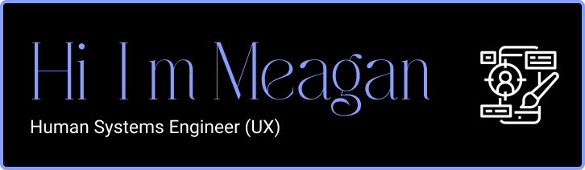

### Hi there 👋

✾ I'm graduating May 2024 with my Bachelor of Science in Human Systems Engineering with a User Experience concentration ✾ and I've gotten more interested in front-end development throughout my classes. 
I am new to HTML and CSS but am learning a lot and am excited at the idea of the possibility of learning new languages.  I want to be a User Experience Designer and with Figma as my preference for software, learning front end tools will make it possible for me to take full advantage of their Dev Mode. 

*:･ﾟ✧*:･ﾟ✧I love using Notion to manage life, and Dribble for inspiration. 
In my free time, I love weightlifting, traveling, watching anime and movies, hiking, and I have an interest in Greek Mythology. *:･ﾟ✧*:･ﾟ✧

<!--
**may-913/may-913** is a ✨ _special_ ✨ repository because its `README.md` (this file) appears on your GitHub profile.

Here are some ideas to get you started:

- 🔭 I’m currently working on ...
- 🌱 I’m currently learning ...
- 👯 I’m looking to collaborate on ...
- 🤔 I’m looking for help with ...
- 💬 Ask me about ...
- 📫 How to reach me: ...
- 😄 Pronouns: ...
- ⚡ Fun fact: ...
-->
